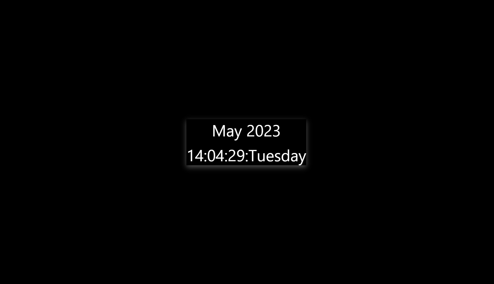

## Hello there!

- This is my first JavaScript work. I tried to make a simple digital clock by using Javascript. 

### See how it looks!
Live Site Url --> [Here]( https://ozlemxates.github.io/Digital-Clock/)

### ScreenShot
- 
### Built With
- HTML
- CSS Flex
- JavaScript

### Thank you for checking out!

